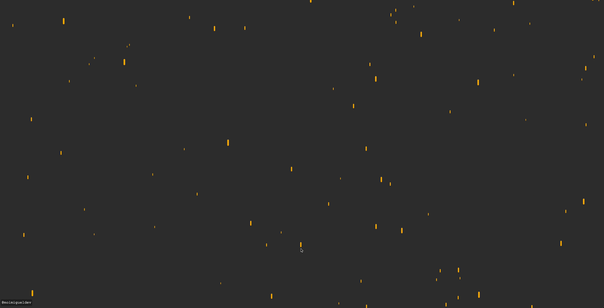

# Orange Rain

This is an animation of orange rain falling with gravity and wind forces(as vectors) interacting with the rain



```
eastWind: (0.5, 0)
westWind: (-0.5, 0)
gravity: between 0.1 and 0.9 depending on weight. Weight depends on height.
velocity: velocity + acceleration
acceleration: gravity
```

To use wind, hold down left and right arrows ⬅️ ➡️
